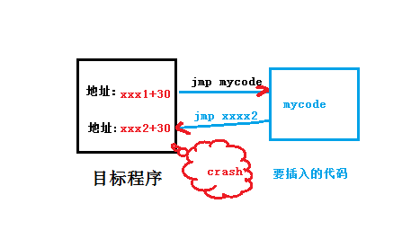

# anti-aslr，过一个简单的aslr保护

## 起因
最近在调一个系统程序，本来是在模拟器调试的一切正常，所有功能都开发完成，可以投入使用了，然而在真机测试的时候发生的crash，当时就闷了，dump内存后，才发现原来真机的loader加入了aslr保护。

今天就给大家说说，我是怎么过这个aslr保护的。

## 科普
先科普一下aslr:
aslr是一种针对缓冲区溢出的安全保护技术，通过对堆、栈、共享库映射等线性区布局的随机化，通过增加攻击者预测目的地址的难度，防止攻击者直接定位攻击代码位置，达到阻止溢出攻击的目的的一种技术。 ASLR（Address space layout randomization）是一种针对缓冲区溢出的安全保护技术，通过对堆、栈、共享库映射等线性区布局的随机化，通过增加攻击者预测目的地址的难度，防止攻击者直接定位攻击代码位置，达到阻止溢出攻击的目的。据研究表明ASLR可以有效的降低缓冲区溢出攻击的成功率，如今Linux、FreeBSD、Windows等主流操作系统都已采用了该技术。

## 分析原因
系统重启后查看imagebase:

 第一次重启

    =================================================================

      0x0C000000  0x0FFFFFFF    67108864  Iomem  R/W    iomem

	  0x60000000  0x7BFFFFFF   469762048  Local  R/W    main

      0x600090F8  0x6200A807    33560336  IText  R/O    main:text

      0x62014C50  0x62F5B1EF    16016800  IData  R/W    main:data

      0x62F5B1F0  0x6333500F     4038176  IBss   R/W    main:bss

第二次重启

    =================================================================

      0x0C000000  0x0FFFFFFF    67108864  Iomem  R/W    iomem

      0x60000000  0x7BFFFFFF   469762048  Local  R/W    main

      0x600092F8  0x6200AA07    33560336  IText  R/O    main:text

      0x62014C50  0x62F5B1EF    16016800  IData  R/W    main:data

      0x62F5B1F0  0x6333500F     4038176  IBss   R/W    main:bss

在程序中插入自己代码的方法

- 找到自己感兴趣的地方,修改源程序，jmp到自己的代码中

- 记住目标程序的地址，自己的代码做完事后，在跳回目标程序

在aslr保护后的系统

 系统重启动后，地址变了，所以我们以前写的程序，就crash了。

绕过aslr保护
 如果我们知道这个浮动的deleta是多少，那么就是可以绕过aslr保护

编写代码

//计算出deleta

    int get_deleta()

    {

            int org_addr = xxxx2;

            int current_addr = getpc();

            return (current_addr - org_addr );

    }

    //获取新的跳转地址

    int get_new_addr(int addr)

    {

            int deleta = get_deleta();

            return (addr+deleta)

    }

## 测试

模拟器测试OK
真机测试OK
